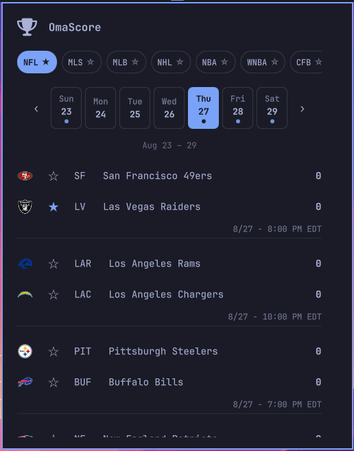
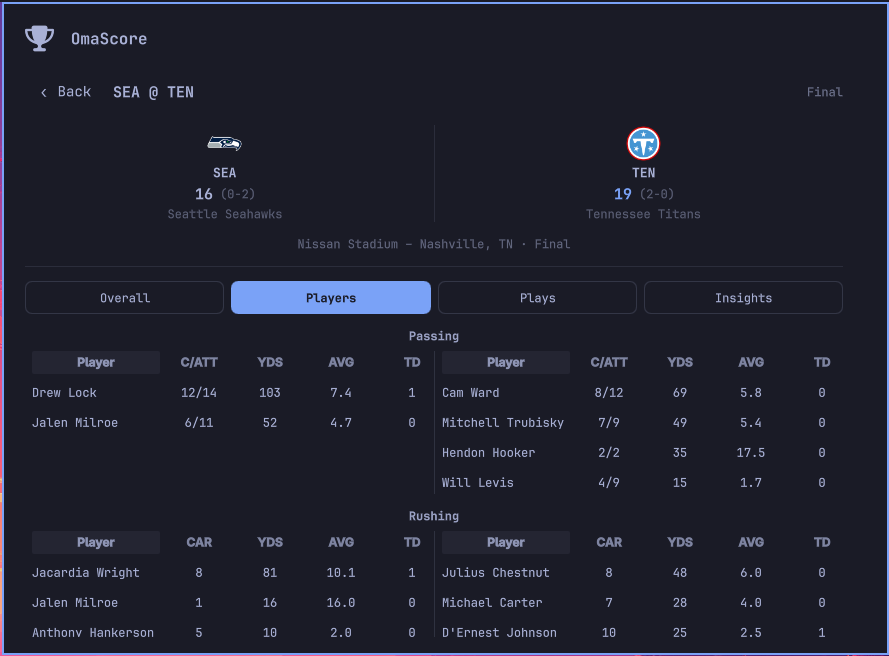

# OmaScore

Omarchy shell plugin that displays live scores for NFL, NBA, MLB, NHL, college football/basketball and soccer in the bar widget, with a details panel showing favorited teams pinned to the top, a league switcher, day/week navigation, and player stats grouped by stat name.

## Install

From a git checkout:

```sh
cp -r . ~/.config/omarchy/plugins/slowburnaz.omascore
omarchy plugin enable slowburnaz.omascore
omarchy bar put slowburnaz.omascore --section right
```

Or via git:

```sh
omarchy plugin add https://github.com/SlowburnAZ/omascore.git --enable
```

## Usage

### Bar Widget

- The bar widget shows live game scores with favorite teams highlighted in accent color.
- Tap a game to open the **details panel** with full stats, venue, and player lists.
- Use the **league switcher** pills at the top to change between NFL, CFB, NBA, WNBA, NCAAM, NCAAW, MLB, NHL, MLS, EPL, LaLiga, Bundesliga, Serie A, Ligue 1, UCL.

### Details Panel

- **Overall tab**: Team statistics split by home/away with a vertical divider (labels are league-specific).
- **Players tab**: Player statistics grouped by category with a fixed 110px Player column and horizontally scrollable stat columns.
- **Favorites**: Teams saved per-league to `~/.local/state/omarchy/omascore-favorites.json` (migrated from old `nfl-favorites.json`) appear pinned at the top of the game list, above live games. Mirrored to `~/.config/omarchy/omascore-favorites.json` so `omarchy plugin disable` / `remove` + `add`/`enable` persists unless you delete both files.
- **Logos**: Team logos loaded from ESPN network sources (transparent PNG).

### Navigation

- All leagues share a **7-day selector** (Sun–Sat). Dots mark days with games; select a day to load its scores (`?dates=YYYYMMDD`).
- Shift weeks with the **‹** / **›** buttons. On open, today is auto-selected — or, if today has no games, the next day that does.

## Remove

```sh
omarchy plugin remove --yes slowburnaz.omascore
```

## Configure

```sh
omarchy bar move slowburnaz.omascore --section right
```

## Dependencies

- `curl` — all ESPN API calls run through it (preinstalled on Omarchy).
- `jq` — counts games per day for the week-selector dots (preinstalled on Omarchy).

## Debugging

QML errors and plugin logs go to the systemd user journal:

```sh
journalctl --user -g "omascore" -f
```

## screenshots


